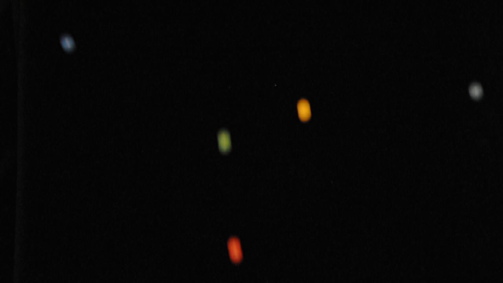
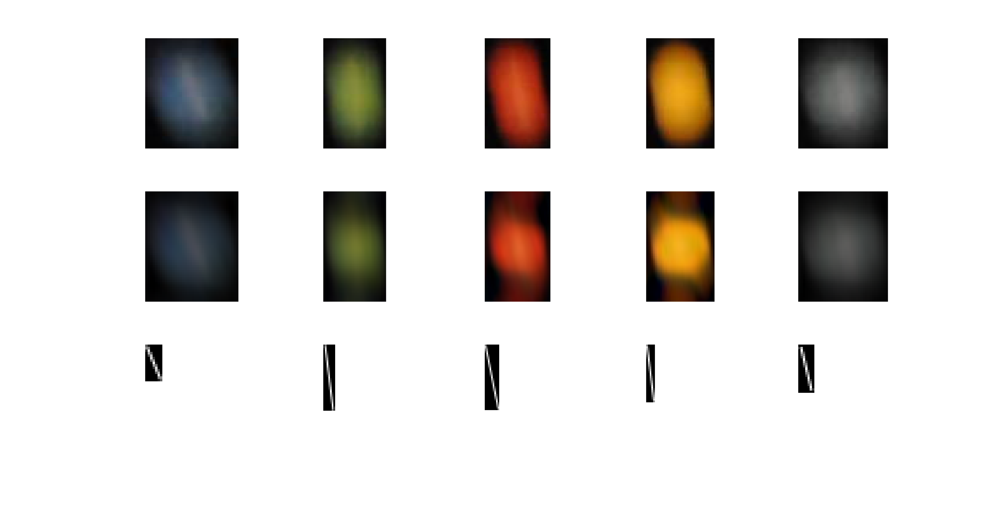

# deblurring-of-fast-moving-objectsfor-quality-control-applications

This algorithm can deblurr indicidual moving objects making use of the Wiener Filter, Object tracking and vector mathematics.

vvvvvvvvvvvvvvv

vvvvvvvvvvvvvvv

